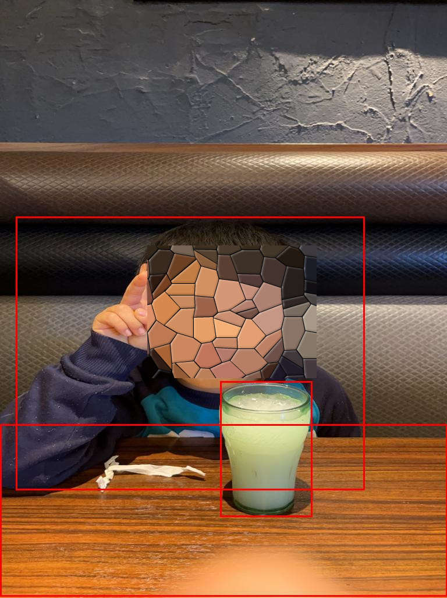

# auto_annotation
## Automatic create bounding box for annotation (Fast RCNN based detection)
Create bounding box in the image automatically.
- If you want to specific label, please check src directory for specific data generate scripts

# auto annotation image
- depends on setting and pretrained model


  
# Directory
<pre>
├── processed
│   └── json_watcher.py
├── raw
└── src
    ├── auto_anosize.py
    ├── captain.py
    ├── customize_model
    │   ├── auto_specialsize.py
    │   └── sepcific_modeler.py
    ├── data_increase.py
    └── im_train.py
</pre>
- precessed : saved train,val and resized image + annotated image data created.
- raq : please save original your image files
- src execute script


## data expansion 
- If you will use few data, it may be used to train accuracy.

`
```
python data_increase.py

```

## Auto annotation  auto_anosize.py
- All in one script auto annotation and generate sample data.
`
```
python auto_anosize.py

```

## Auto annotation  im_train.py
- Training script

```
python im_train.py

```

## Object detection based on fast rcnn  captain.py
- Training script
```
python captain.py

```
